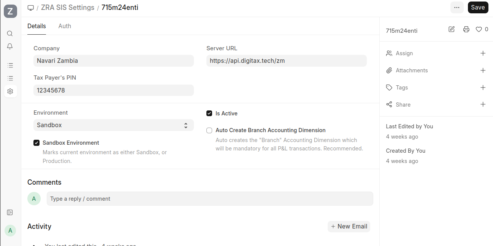
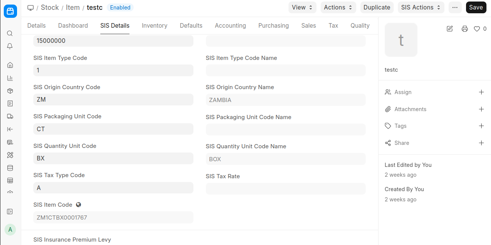
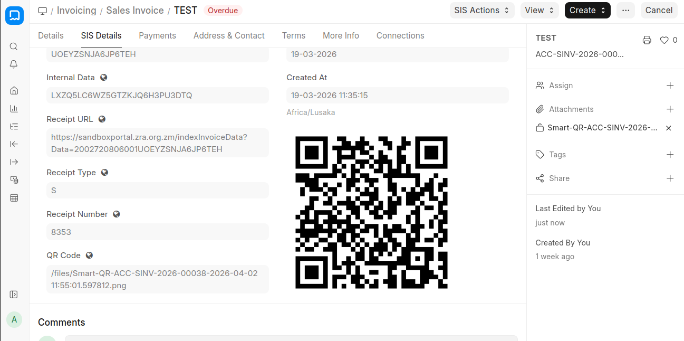
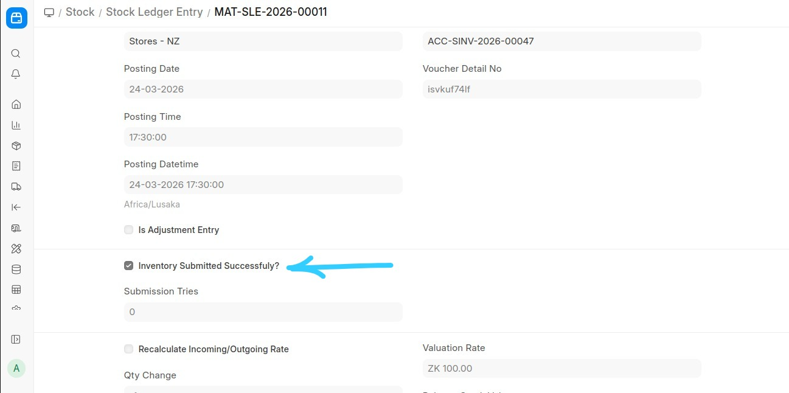
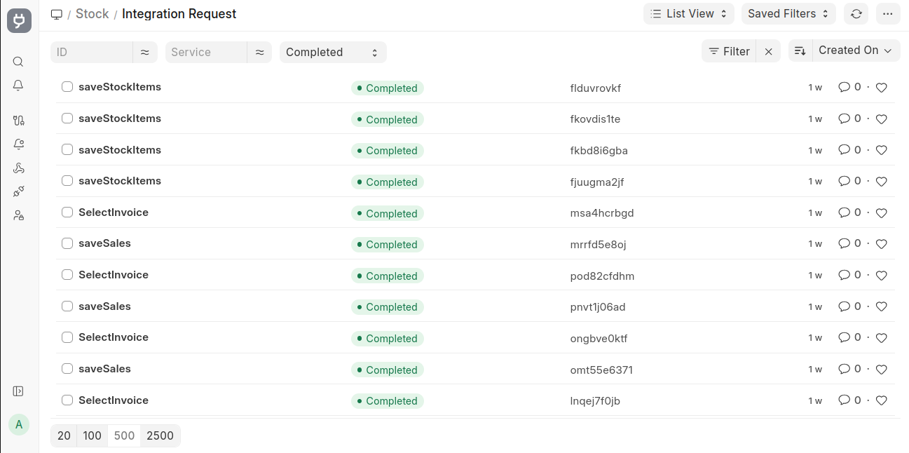

# Zambia Compliance via Digitax
### Overview

This Frappe/ERPNext integration allows businesses in Zambia to manage ZRA-compliant e-invoicing, stock, and tax reporting directly from ERPNext. The system communicates with the ZRA Digitax API to submit invoices, credit/debit notes, and stock updates securely and automatically.

All interactions are authenticated using API keys.

Official documentation: [Zambia Compliance Via Digitax](https://docs.navari.co.ke/zambia-compliance-via-digitax/)

## Key Features
- **API Key Authentication** – Secure access without device registration
- **Item Registration** – Map ERPNext items to ZRA-compliant codes
- **Sales Management** – Submit sales invoices, credit notes, and debit notes
- **Customer Management** – Allows registration for customers with the Authority
- **Stock Synchronization** – Automatic updates for all stock transactions
- **Scheduled Submissions** – Stock entries and ledger updates are submitted automatically every 4 minutes
- **Background Jobs & Logging** – Track all API requests and responses for auditing

## Configuration
Go to ZRA SIS Settings in ERPNext
Enter:
Company Details
Server URL
TPIN
API Key
Save and mark settings as Active



## Workflow Overview
### 1. Item Registration
ERPNext items must be mapped to ZRA codes: classification, VAT, excise, packaging, and quantity units
Registration can happen automatically on save or via Register Item button



### 2. Sales Management
Submit Sales Invoices, Credit Notes, and Debit Notes
Uses /SalesInformation/SaveSales, /SaveCreditNote, /SaveDebitNote endpoints
Automatic submission occurs on invoice submission; manual resubmission available via Send Invoice action



### 3. Stock Synchronization
All stock-affecting transactions are automatically submitted to Digitax:
Stock Entries
Sales
Purchases & Imports
Stock Reconciliations
Scheduler runs every 4 minutes to submit all pending stock ledger entries
Ensures real-time alignment with ZRA records



### 5. Background Jobs & Logging
Item registration, sales, and stock submissions are asynchronous
Jobs are tracked under Background Jobs Desk
Requests and responses logged for auditing in Integration Requests



### Best Practices
Ensure items are registered before invoicing
Always verify tax codes and categories
Monitor Integration Requests for submission success
Maintain consistent invoice numbering
Use scheduled stock sync to avoid discrepancies

### Developer Notes
Payloads built in utils/payload_utils.py
API requests orchestrated via apis/api_processor.py
Errors logged via ErrorObserver
Jobs enqueued asynchronously with enqueue

##  Integrated Endpoints
| #  | Endpoint Name | ERPNext DocType | Purpose |
|----|---------------|----------------|---------|
| 1  | `/v1/items` (Item Management) | Item | Registers ERPNext items in Smart Zambia system |
| 2  | `/v1/items/{item_id}` | Item | Update specific product item details |
| 3  | `/v1/items/{item_id}` | Item | Retrieves details of a product item based on the provided Item code |
| 4  | `/v1/sales` (Sales Management) | Normal Sales, LPO, Export Invoice | Accepts invoice information, customized to a particular invoicing system, and submits it to ZRA |
| 5  | `/v1/credit-notes` (Sales Management) | Credit Note | Accepts credit invoice information and submits it to ZRA |
| 6  | `/v1/sales/{sale_id}` (Sales Management) | Sales Invoice | Takes a SelectInvoice query and returns the invoice that exists in the ZRA environment |
| 7  | `/v1/debit-notes` | Sales | Accepts debit invoice information and submits it to ZRA |
| 8  | `/v1/stock/adjust` (Stock Adjustment) | Stock Item Information | Adds stock items that have been recorded from approved sales to Smart Invoice |
| 9  | `/v1/customers` (Customer) | Customer | Save Customer |
| 10 | `/v1/customers/{customer_id}` | Customer | Retrieves Customer Details |

### Installation

You can install this app using the [bench](https://github.com/frappe/bench) CLI:

```bash
cd $PATH_TO_YOUR_BENCH
bench get-app $URL_OF_THIS_REPO --branch develop
bench install-app zambia_compliance_via_digitax
```

### Contributing

This app uses `pre-commit` for code formatting and linting. Please [install pre-commit](https://pre-commit.com/#installation) and enable it for this repository:

```bash
cd apps/zambia_compliance_via_digitax
pre-commit install
```

Pre-commit is configured to use the following tools for checking and formatting your code:

- ruff
- eslint
- prettier
- pyupgrade

### License

mit
